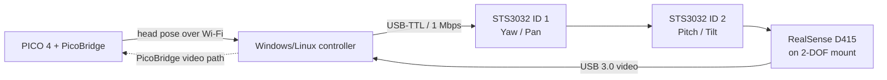
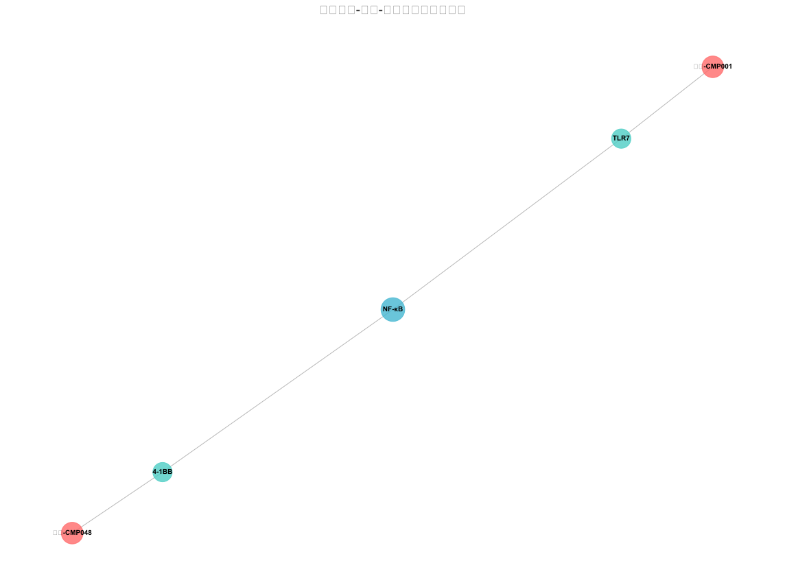

# Zicheng Xu

`Mechanism · Algorithm · Intelligence`

Email: **xzc18155121449@163.com**

---

I build robot systems where **hardware design and software algorithms are co-optimized** — from 3D-printed mechanical structures and embedded servo control to physics-informed neural networks and real-time perception pipelines. My work spans the full robotics stack: mechanical CAD, embedded firmware, control systems, computer vision, deep learning, and simulation.

---

## Active Vision Platform

*PICO 4 head tracking → dual-axis STS3032 gimbal → Intel RealSense D415 — "head moves, view moves"*

**System pipeline:**



<table>
<tr>
<td width="33%" align="center"></td>
<td width="33%" align="center"></td>
<td width="34%" align="center"></td>
</tr>
<tr>
<td align="center"><sub>2-DOF camera gimbal — front view</sub></td>
<td align="center"><sub>Fully assembled on wheeled robot</sub></td>
<td align="center"><sub>Camera module and mounting structure</sub></td>
</tr>
</table>

**System architecture:**

| Layer | Component | Specification |
|---|---|---|
| Motion capture | PICO 4 VR headset | Quaternion head pose at ~50 Hz, body-relative tracking |
| Servo control | Feetech STS3032 × 2 | Yaw ID1 + Pitch ID2, RS485 bus, 1 Mbps, 12 V |
| Depth camera | Intel RealSense D415 | 1280×720 depth + RGB, USB 3.0 |
| Controller | Windows/Linux PC | PD controller, limit calibration, video forwarding |
| Mechanical | 3D-printed PLA/PETG | Full STL + STEP, BOM, assembly guide included |
| Simulation | URDF + MuJoCo + Gazebo | Digital twin before hardware deployment |

This is the core of **[robot_platform](https://github.com/zc-xzc/robot_platform)**.

*Python, ROS, C++, RealSense, 3D Printing, URDF, MuJoCo*

---

## Featured Projects

### [robot_platform](https://github.com/zc-xzc/robot_platform) ★ 3

An end-to-end active vision system for humanoid robots. The operator wears a PICO 4 headset; head movement is captured as quaternion data, transformed into body-relative yaw/pitch commands, and sent over USB-TTL to two STS3032 servos driving a custom 2-DOF camera gimbal. The RealSense D415 follows the operator's view and streams video back through PicoBridge.

**Includes:**
- Printable STL/STEP mechanical models (main mount, tilt bracket, camera support)
- Active vision distribution package for Windows and Linux
- PD controller with configurable limits, offsets, acceleration, and direction
- First-run limit calibration and servo PID/dead-zone tuning
- URDF description + Gazebo launch files + MuJoCo XML
- Compatible with Unitree G1 humanoid robot (via adapter parts)
- ZED Mini stereo camera variant also supported

---

### [fsi-coatings](https://github.com/zc-xzc/fsi-coatings)

A research notebook exploring **fluid-structure interaction (FSI) for steel bridge coating degradation** — a multi-field coupling problem involving mechanical stress, thermal cycling, and hygrothermal diffusion in protective coatings.

**Methodology:** Physics-informed neural networks (PINNs) + finite element analysis (FEM)

**Repository structure:**
```
topics/fsi-coatings/
├── papers/            annotated reading notes on FSI literature
├── codes/             numerical experiments and reproduction
│   ├── paper-reproduction/  Qi Yanfu model fitting
│   └── reproduction/        run_all.py pipeline
├── references/        curated bibliography, software install guides
└── projects/          project management documents
```

*Python, FEM, PINNs, FSI*

---

### [TCM-Immuno-AntiTumor-Screening](https://github.com/zc-xzc/TCM-Immuno-AntiTumor-Screening) ★ 1

Multi-dimensional data analysis platform for screening **immune-activating anti-tumor active components** from Traditional Chinese Medicine (TCM). Integrates LLM-based retrieval-augmented generation with multi-omics data processing to identify candidate compounds with dual immune-activation and anti-tumor efficacy.

**Screening workflow:**
High-throughput data processing → multi-dimensional scoring → KEGG/GO enrichment analysis → PPI network construction → drug-target-pathway integration → candidate ranking

**Key analysis outputs:**

<table>
<tr>
<td width="50%" align="center"><br/><sub>Drug-target interaction network — compound-protein relationships</sub></td>
<td width="50%" align="center"><br/><sub>Multi-omics feature correlation heatmap — immune and tumor markers</sub></td>
</tr>
<tr>
<td width="50%" align="center"><br/><sub>Drug-target-pathway network — mechanism of action analysis</sub></td>
<td width="50%" align="center"><br/><sub>Candidate compound scoring — immune activation vs anti-tumor activity</sub></td>
</tr>
</table>

*Python, Data Science, Bioinformatics, LLM, Network Pharmacology*

---

### [MathViz](https://github.com/zc-xzc/MathViz) — [Live Demo](https://zc-xzc.github.io/MathViz/)

Interactive math visualization platform that transforms abstract mathematical concepts into observable, manipulable 3D and 2D structures. Built with Three.js and D3.js.

**Current modules:**
- **Linear algebra** — 3D equation system solver supporting arbitrary 3×3 matrix input with dynamic solution reconstruction
- **Higher mathematics** — calculus visualizations (in development)
- **Exam prep zone** — formula reference and categorized problem index

**Planned:** eigenvector visualization, Riemann sum demonstration, Taylor series expansion, ε-δ limit illustration.

*HTML, Three.js, D3.js, WebGL*

---

## Other Work

| Project | Description | Tools |
|---|---|---|
| [HandEye-Tsai](https://github.com/zc-xzc/HandEye-Tsai) | Hand-eye calibration using Tsai method with real camera + VICON motion capture data | MATLAB |
| [Water_robot](https://github.com/zc-xzc/Water_robot) | YOLOv5 detection pipeline adapted for underwater low-visibility perception | C, YOLO |
| [Docker-Localization](https://github.com/zc-xzc/Docker-Localization) ★ 1 | Automated Docker image mirroring from Docker Hub to Alibaba Cloud via GitHub Actions | GitHub Actions, Docker |
| [Dual-eye 3D Recon](https://github.com/zc-xzc/Dual-eye-three-dimensional-reconstruction-system---Two-target-calibration---Stereoscopic-correction) | Binocular stereo vision system with dual-target calibration, stereo correction, and YOLOv12 optimization | Python, OpenCV |

---

## Technical Competencies

**Languages:** Python, MATLAB, C, C++, Bash  
**Deep Learning:** PyTorch, ONNX, YOLO, Physics-Informed Neural Networks  
**Robotics:** ROS (Noetic/Humble), MoveIt, Gazebo, MuJoCo  
**Computer Vision:** OpenCV, RealSense SDK, Stereo Matching, Hand-Eye Calibration, YOLO  
**Hardware:** STM32, Jetson Orin/Nano, PICO 4, Feetech STS3032 Servos, 3D Printing (FDM/SLA)  
**CAD:** SolidWorks, Fusion 360, Autodesk Inventor  
**Tools:** Docker, Git, Linux, LaTeX

---

## Contact

- **Email:** xzc18155121449@163.com
- **GitHub:** [zc-xzc](https://github.com/zc-xzc)
- **Bilibili:** [space.bilibili.com/1664940404](https://space.bilibili.com/1664940404)

---

<sub>Mechanism · Algorithm · Intelligence</sub>
