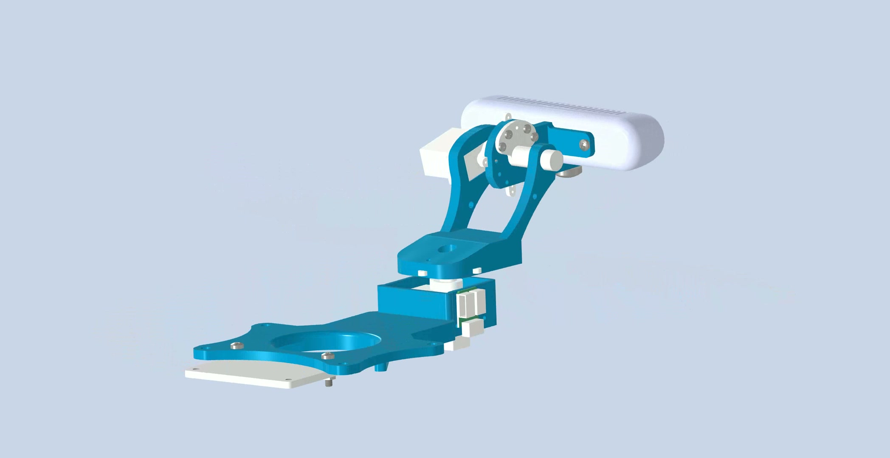
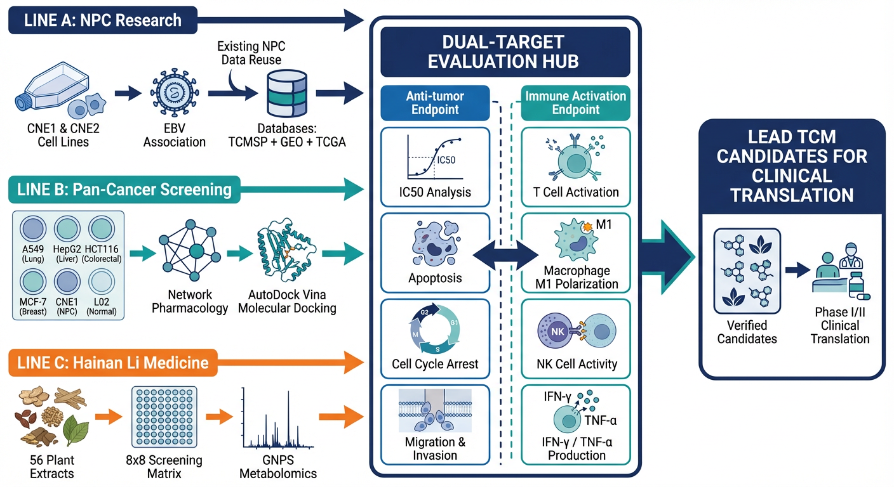
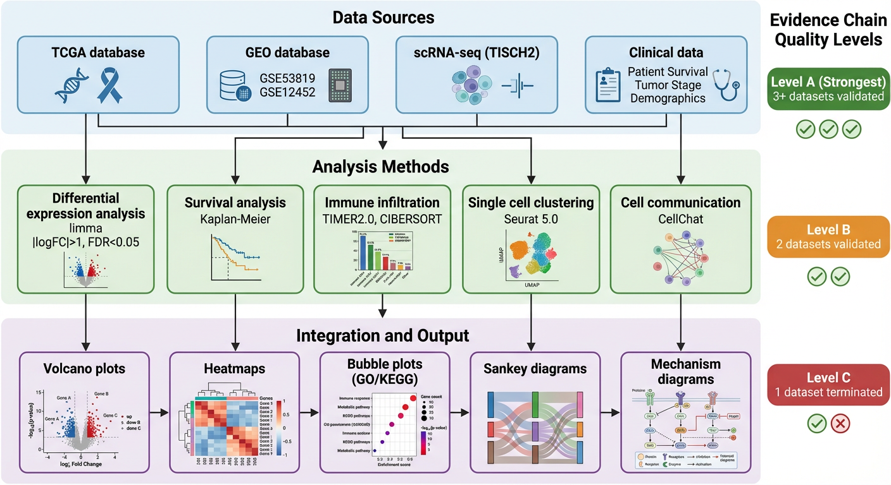
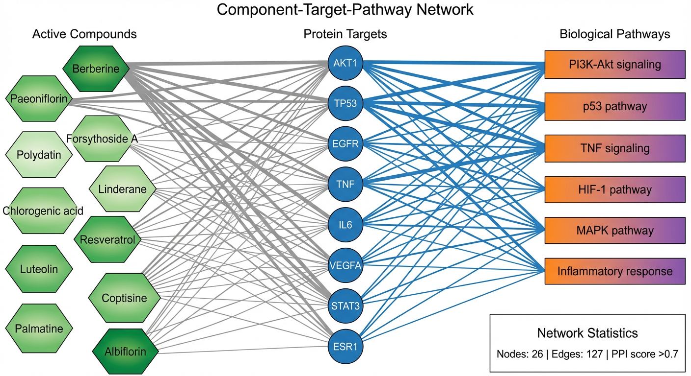
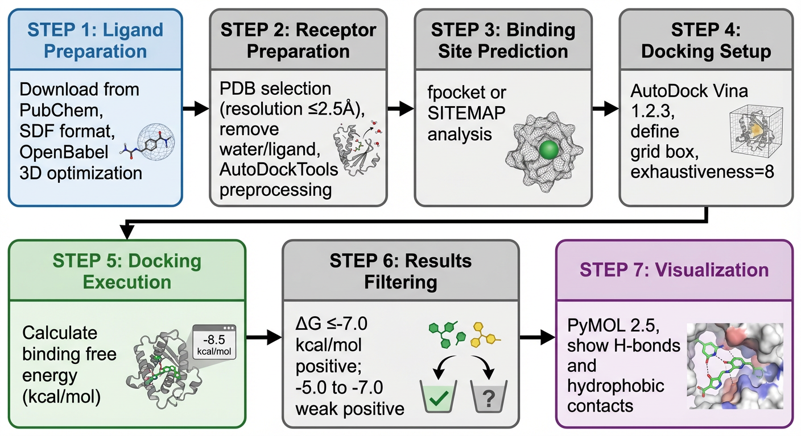
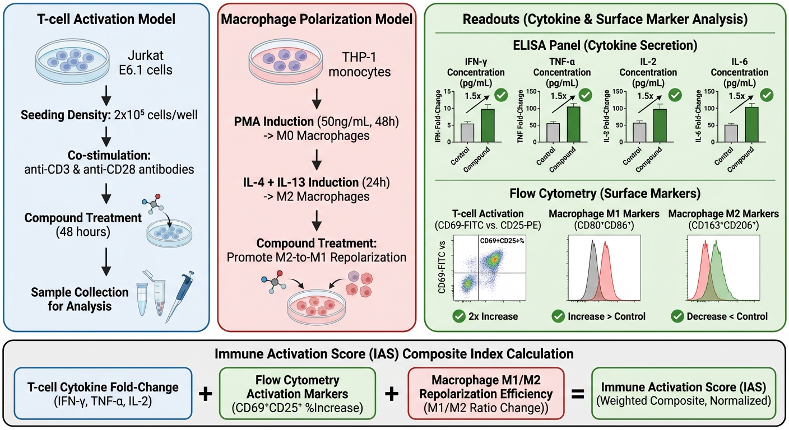
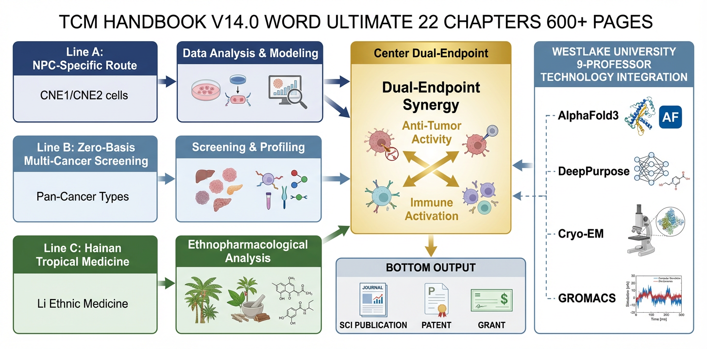

# Zicheng Xu · 许子成

**Mechanism · Algorithm · Intelligence**

📧 xzc18155121449@163.com

---

| [**robot_platform**](https://github.com/zc-xzc/robot_platform) ★3 | [**fsi-coatings**](https://github.com/zc-xzc/fsi-coatings) | [**TCM-Immuno**](https://github.com/zc-xzc/TCM-Immuno-AntiTumor-Screening) ★1 | [**MathViz**](https://github.com/zc-xzc/MathViz) |
|---|---|---|---|
| Active vision gimbal for humanoid robots | FSI × steel coating aging simulation | Multi-omics TCM drug screening | Interactive 3D/2D math viz |

---

## 🤖 robot_platform

*PICO 4 → STS3032 gimbal → RealSense D415 — full-stack active vision*

<table>
<tr>
<td width="33%" align="center"><br/><sub>Exploded view</sub></td>
<td width="33%" align="center"><br/><sub>Assembled gimbal</sub></td>
<td width="34%" align="center"><br/><sub>On robot platform</sub></td>
</tr>
</table>

Tracking → PD controller → serial-bus servos → depth video → simulation. STL parts, URDF/MuJoCo, Win/Linux software, Unitree G1 adapter.

---

## 🏗️ fsi-coatings

Multi-field coupling of steel bridge coating degradation: PINNs + FEM under mechanical-thermal-hygro environments.

```
topics/fsi-coatings/
├── papers/         literature notes (Qi Yanfu et al.)
├── codes/          reproduction & numerical experiments
├── references/     bibliography & software guides
└── projects/       task management
```

---

## 💊 TCM-Immuno-AntiTumor-Screening ★1

**Multi-omics drug discovery from Traditional Chinese Medicine**

High-throughput screening → multi-dimensional scoring → KEGG/GO enrichment → PPI network → drug-target-pathway → candidate ranking

<table>
<tr>
<td align="center"><br/><sub>Graphical abstract — screening overview</sub></td>
<td align="center"><br/><sub>Multi-omics integration framework</sub></td>
<td align="center"><br/><sub>Network pharmacology pathway</sub></td>
</tr>
<tr>
<td align="center"><br/><sub>Molecular docking workflow</sub></td>
<td align="center"><br/><sub>Immune activation workflow</sub></td>
<td align="center"><br/><sub>Ultimate abstract — full mechanism</sub></td>
</tr>
</table>

---

## 📐 MathViz

[Live Demo](https://zc-xzc.github.io/MathViz/) — 3D equation solver (✅ live), calculus viz (🔄), eigenvectors (📋)

---

## 🔧 Others

| Project | Stack |
|---|---|
| [HandEye-Tsai](https://github.com/zc-xzc/HandEye-Tsai) — Tsai calibration + VICON | MATLAB |
| [Water_robot](https://github.com/zc-xzc/Water_robot) — underwater YOLOv5 | C, YOLO |
| [Docker-Localization](https://github.com/zc-xzc/Docker-Localization) ★1 — cross-registry mirror | GitHub Actions |
| [Dual-eye 3D Recon](https://github.com/zc-xzc/Dual-eye-three-dimensional-reconstruction-system---Two-target-calibration---Stereoscopic-correction) — stereo + YOLOv12 | Python, OpenCV |

---

## 🛠️ Skills

Python · PyTorch · MATLAB · C/C++ · ROS · OpenCV · RealSense · STM32 · Jetson · Docker · Git · Linux · SolidWorks · Fusion 360

---

📧 xzc18155121449@163.com · 🐙 [github.com/zc-xzc](https://github.com/zc-xzc) · 🎬 [space.bilibili.com/1664940404](https://space.bilibili.com/1664940404)

---

<sub>Mechanism · Algorithm · Intelligence</sub>
