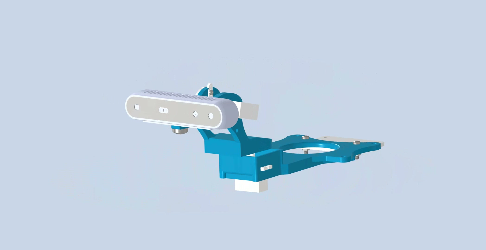
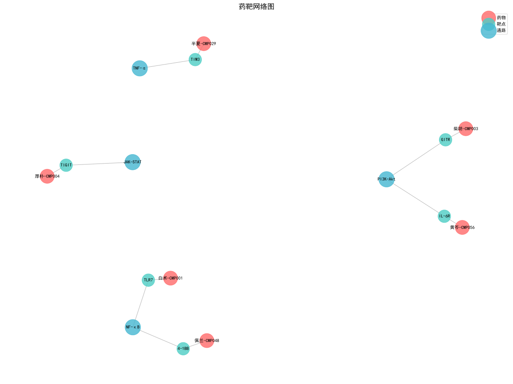
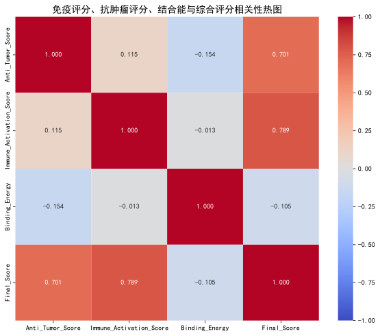
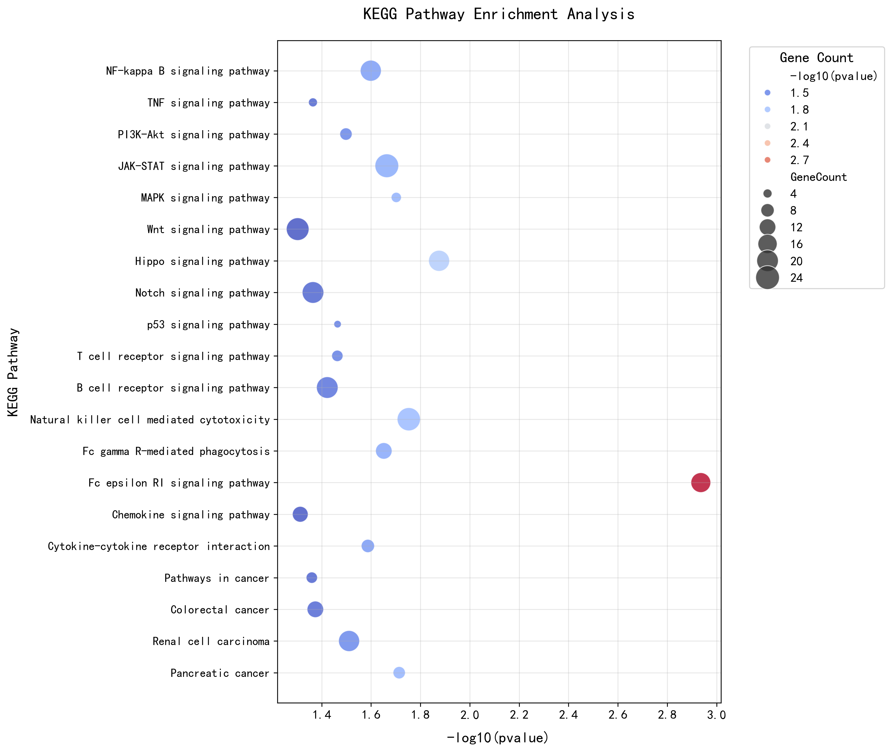
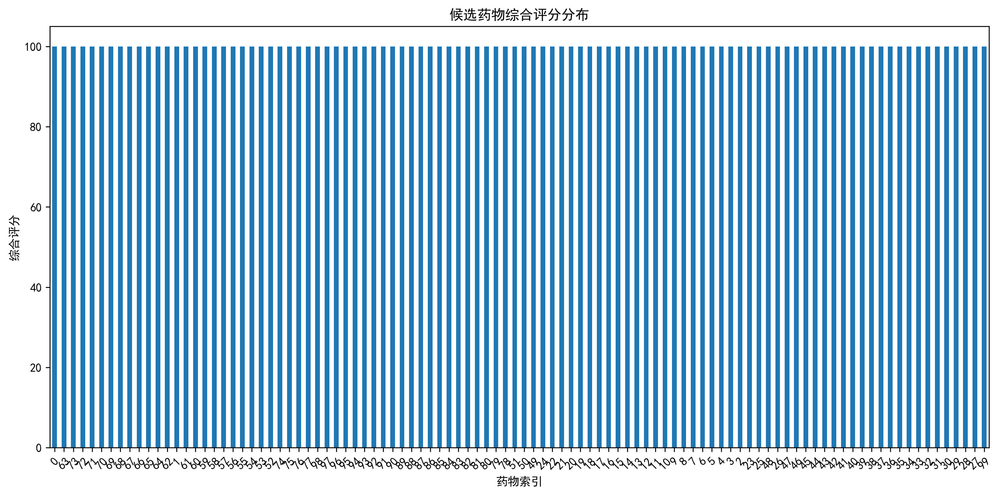

# 🚀 Zicheng Xu

**Mechanism · Algorithm · Intelligence**

*Email: xzc18155121449@163.com*

---

## 📋 Portfolio Overview

| Project | Description | Stars | Tags |
|---|---|---|---|
| [**robot_platform**](https://github.com/zc-xzc/robot_platform) | Head-tracking active vision gimbal for humanoid robots — full-stack hardware + software | ★ 3 | `Python·ROS·3DPrint·RealSense` |
| [**fsi-coatings**](https://github.com/zc-xzc/fsi-coatings) | FSI multi-field coupling simulation of bridge coating degradation with PINNs | | `Python·FEM·PINNs·FSI` |
| [**TCM-Immuno**](https://github.com/zc-xzc/TCM-Immuno-AntiTumor-Screening) | Multi-omics screening platform for immune-activating anti-tumor TCM components | ★ 1 | `Python·Bioinfo·LLM·NetworkPharm` |
| [**MathViz**](https://github.com/zc-xzc/MathViz) | Interactive 3D/2D math visualizations for linear algebra & calculus | | `Three.js·D3.js·WebGL` |
| [**HandEye-Tsai**](https://github.com/zc-xzc/HandEye-Tsai) | Hand-eye calibration with Tsai method — real camera + VICON mocap | | `MATLAB·Calibration` |
| [**Water_robot**](https://github.com/zc-xzc/Water_robot) | YOLOv5 underwater perception for low-visibility environments | | `C·YOLO·Embedded` |
| [**Docker-Localization**](https://github.com/zc-xzc/Docker-Localization) | Docker image mirroring to Alibaba Cloud via GitHub Actions | ★ 1 | `Docker·GitHubActions` |
| [**Dual-eye 3D Recon**](https://github.com/zc-xzc/Dual-eye-three-dimensional-reconstruction-system---Two-target-calibration---Stereoscopic-correction) | Binocular stereo vision with YOLOv12 optimization | | `Python·OpenCV·Stereo` |

---

## 🤖 robot_platform — Active Vision for Humanoid Robots ★ 3

*PICO 4 head tracking → dual-axis STS3032 gimbal → Intel RealSense D415*

**End-to-end system where mechanical design, embedded control, and computer vision converge into a single perception platform.**

<table>
<tr>
<td align="center" width="50%"><br/><sub>Exploded view — all mechanical components</sub></td>
<td align="center" width="50%"><br/><sub>Assembled camera gimbal — final perspective</sub></td>
</tr>
<tr>
<td align="center" width="50%"><br/><sub>Left side — full gimbal assembly on robot</sub></td>
<td align="center" width="50%"><br/><sub>Right side — alternate perspective</sub></td>
</tr>
</table>

**System architecture:**

| Layer | Component | Spec |
|---|---|---|
| 🎮 Operator input | PICO 4 VR headset | Quaternion head pose @ ~50 Hz |
| ⚙️ Actuation | Feetech STS3032 × 2 | RS485 bus, 1 Mbps, 12 V |
| 📷 Perception | Intel RealSense D415 | 1280×720 depth + RGB |
| 🖥️ Controller | Windows / Linux PC | PD controller + calibration + video |
| 🔧 Mechanics | Custom 3D-printed mount | PLA/PETG, STL + STEP, full BOM |
| 🕹️ Simulation | URDF + MuJoCo + Gazebo | Digital twin before hardware |

**Includes:** printable STL/STEP files · PD controller with configurable limits · limit calibration · servo PID tuning · URDF + Gazebo launch files · MuJoCo XML · Unitree G1 adapter parts · ZED Mini variant support

---

## 🏗️ fsi-coatings — FSI × Steel Coating Aging

**Multi-field coupling research: fluid-structure interaction meets physics-informed deep learning for infrastructure durability.**

```
topics/fsi-coatings/
├── papers/          annotated literature (Qi Yanfu et al.)
├── codes/           reproduction & numerical experiments
│   ├── paper-reproduction/    model fitting scripts
│   └── reproduction/         automated pipeline (run_all.py)
├── references/      curated bibliography + install guides
└── projects/        project management
```

Steel bridge coatings degrade under coupled **mechanical stress + thermal cycling + hygrothermal diffusion**. This project uses PINNs + FEM to model the interaction and predict remaining useful life.

---

## 💊 TCM-Immuno-AntiTumor-Screening ★ 1

**Multi-dimensional drug discovery: screening Traditional Chinese Medicine for compounds with dual immune-activation and anti-tumor efficacy.**

**Workflow:** High-throughput processing → multi-dimensional scoring → KEGG/GO enrichment → PPI network → drug-target-pathway integration → candidate ranking

<table>
<tr>
<td align="center" width="50%"><br/><sub>Compound-protein interaction network</sub></td>
<td align="center" width="50%"><br/><sub>Multi-omics feature correlation — immune & tumor markers</sub></td>
</tr>
<tr>
<td align="center" width="50%"><br/><sub>KEGG pathway enrichment — mechanism analysis</sub></td>
<td align="center" width="50%"><br/><sub>Candidate scoring: immune activation vs anti-tumor activity</sub></td>
</tr>
</table>

---

## 📐 MathViz — Interactive Math Visualization

*[Live Demo →](https://zc-xzc.github.io/MathViz/)*

Transforming abstract mathematics into observable, manipulable 3D/2D structures. Built on Three.js + D3.js.

| Module | Status | Description |
|---|---|---|
| 3D Equation System Solver | ✅ Live | Arbitrary 3×3 matrix input, dynamic solution reconstruction |
| Calculus Visualizations | 🔄 In progress | Limit, derivative, integral demonstrations |
| Eigenvector Visualization | 📋 Planned | Interactive geometric interpretation |
| Exam Prep Zone | 📋 Planned | Formula reference + problem index |

---

## 🔬 Other Research & Tools

| Project | Key Contribution | Tools |
|---|---|---|
| [HandEye-Tsai](https://github.com/zc-xzc/HandEye-Tsai) | Hand-eye calibration with Tsai method — validated with real camera + VICON | `MATLAB` |
| [Water_robot](https://github.com/zc-xzc/Water_robot) | YOLOv5 adapted for underwater perception — solves low-visibility detection | `C` `YOLO` |
| [Docker-Localization](https://github.com/zc-xzc/Docker-Localization) ★ 1 | Automated cross-registry Docker image mirroring | `GitHub Actions` |
| [Dual-eye 3D Reconstruction](https://github.com/zc-xzc/Dual-eye-three-dimensional-reconstruction-system---Two-target-calibration---Stereoscopic-correction) | Full-stack stereo vision with dual-target calibration + YOLOv12 | `Python` `OpenCV` |

---

## 🛠️ Technical Arsenal

| Domain | Skills |
|---|---|
| **Languages** | Python, MATLAB, C, C++, Bash |
| **Deep Learning** | PyTorch, ONNX, YOLO, Physics-Informed Neural Networks |
| **Robotics** | ROS (Noetic/Humble), MoveIt, Gazebo, MuJoCo |
| **Computer Vision** | OpenCV, RealSense SDK, Stereo Matching, Hand-Eye Calibration |
| **Hardware** | STM32, Jetson Orin/Nano, PICO 4, Feetech STS3032, 3D Printing (FDM/SLA) |
| **CAD & Design** | SolidWorks, Fusion 360, Autodesk Inventor |
| **DevOps & Tools** | Docker, Git, Linux, LaTeX, GitHub Actions |

---

## 📬 Contact & Links

| | |
|---|---|
| 📧 **Email** | xzc18155121449@163.com |
| 🐙 **GitHub** | [zc-xzc](https://github.com/zc-xzc) |
| 🎬 **Bilibili** | [space.bilibili.com/1664940404](https://space.bilibili.com/1664940404) |

---

<sub>**Mechanism · Algorithm · Intelligence**</sub>
