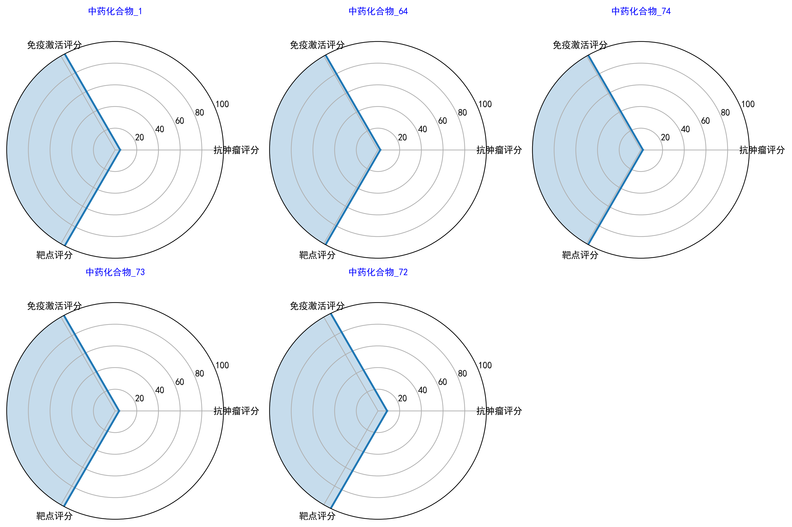
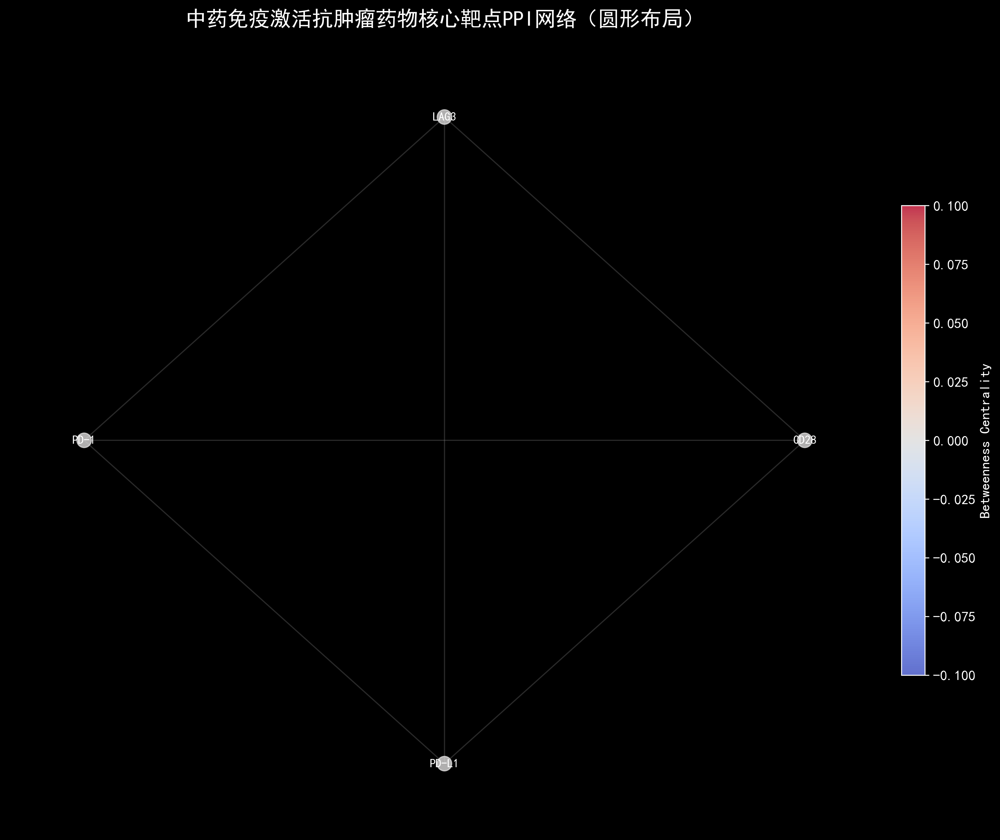
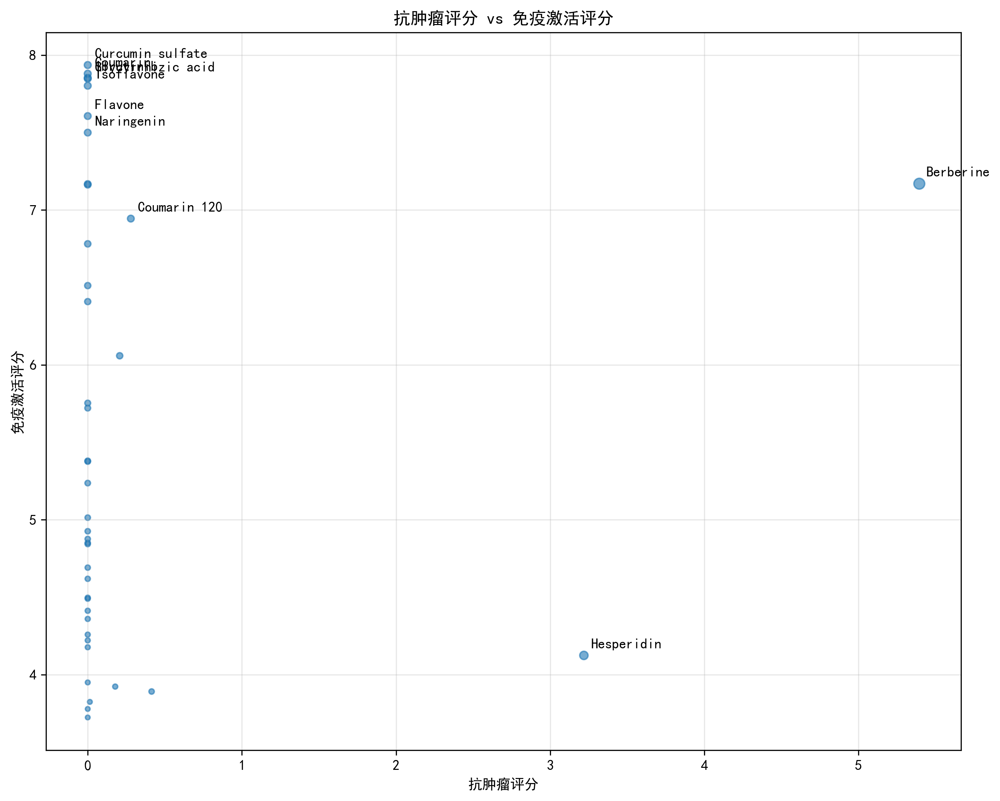

# Zicheng Xu

**Mechanism · Algorithm · Intelligence**

📧 xzc18155121449@163.com

---

## Portfolio

| Project | Description | Tags |
|---|---|---|
| [**robot_platform**](https://github.com/zc-xzc/robot_platform) ★ 3 | Active vision gimbal for humanoid robots — full-stack hardware × software | Python, ROS, 3D Print, RealSense |
| [**fsi-coatings**](https://github.com/zc-xzc/fsi-coatings) | FSI multi-field coupling for steel coating degradation | Python, FEM, PINNs, FSI |
| [**TCM-Immuno-AntiTumor-Screening**](https://github.com/zc-xzc/TCM-Immuno-AntiTumor-Screening) ★ 1 | Multi-omics screening for TCM immune-activating compounds | Python, Bioinfo, LLM, Network Pharm |
| [**MathViz**](https://github.com/zc-xzc/MathViz) | Interactive 3D/2D math visualizations | Three.js, D3.js, WebGL |
| [**HandEye-Tsai**](https://github.com/zc-xzc/HandEye-Tsai) | Hand-eye calibration (Tsai) with VICON validation | MATLAB |
| [**Water_robot**](https://github.com/zc-xzc/Water_robot) | Underwater YOLOv5 perception | C, YOLO |
| [**Docker-Localization**](https://github.com/zc-xzc/Docker-Localization) ★ 1 | Cross-registry Docker image mirroring | GitHub Actions |
| [**Dual-eye 3D Recon**](https://github.com/zc-xzc/Dual-eye-three-dimensional-reconstruction-system---Two-target-calibration---Stereoscopic-correction) | Binocular stereo + YOLOv12 | Python, OpenCV |

---

## 🤖 robot_platform

**Active Vision System for Humanoid Robots** ★ 3

*PICO 4 head tracking → dual-axis STS3032 gimbal → Intel RealSense D415*

<table>
<tr>
<td align="center" width="33%"><br/><sub>Exploded view — complete mechanical assembly</sub></td>
<td align="center" width="33%"><br/><sub>Assembled 2-DOF camera gimbal</sub></td>
<td align="center" width="34%"><br/><sub>Side view — mounted on robot platform</sub></td>
</tr>
</table>

Full-stack project integrating mechanical CAD, embedded servo control, VR headset tracking, computer vision, and simulation:

| Layer | Component | Details |
|---|---|---|
| Tracking | PICO 4 | Quaternion head pose @ 50 Hz |
| Control | STS3032 × 2 | RS485, 1 Mbps, PD controller |
| Vision | RealSense D415 | Depth + RGB, USB 3.0 |
| Structure | 3D-printed mount | PLA/PETG, STL + STEP included |
| Simulation | URDF / MuJoCo / Gazebo | Digital twin before deployment |

**Downloads:** STL files for 3D printing · software package for Windows/Linux · URDF for ROS/Gazebo · MuJoCo XML

---

## 🏗️ fsi-coatings

**Fluid-Structure Interaction × Steel Bridge Coating Degradation**

Multi-field coupling research combining physics-informed neural networks (PINNs) with finite element analysis (FEM) to model coating aging under coupled mechanical-thermal-hygro environments.

```
topics/fsi-coatings/
├── papers/         annotated literature on FSI × coatings
├── codes/          numerical experiments and reproduction
│   ├── paper-reproduction/   Qi Yanfu model fitting
│   └── reproduction/         automated run_all.py pipeline
├── references/     curated bibliography × install guides
└── projects/       research task management
```

---

## 💊 TCM-Immuno-AntiTumor-Screening ★ 1

**Multi-Dimensional Drug Discovery from Traditional Chinese Medicine**

Screening pipeline for compounds with dual immune-activation and anti-tumor efficacy: high-throughput data → multi-dimensional scoring → enrichment analysis → network pharmacology → candidate ranking.

<table>
<tr>
<td align="center" width="50%"><br/><sub>Candidate compound radar chart — multi-dimensional scoring</sub></td>
<td align="center" width="50%"><br/><sub>PPI network — circular layout of protein interactions</sub></td>
</tr>
<tr>
<td align="center" width="50%"><br/><sub>Immune activation vs anti-tumor activity — comparative scatter</sub></td>
<td align="center" width="50%"><br/><sub>KEGG pathway enrichment bubble chart — mechanism analysis</sub></td>
</tr>
</table>

---

## 📐 MathViz

**Interactive Math Visualization** — [Live Demo →](https://zc-xzc.github.io/MathViz/)

Transforming abstract mathematical concepts into observable 3D/2D structures via Three.js and D3.js.

| Module | Status |
|---|---|
| 3×3 Equation System Solver | ✅ Live |
| Calculus Visualizations | 🔄 In Progress |
| Eigenvector / Eigenvalue Visualization | 📋 Planned |
| Riemann Sum / Taylor Series | 📋 Planned |

---

## 🔧 Other Projects

| Project | Contribution | Stack |
|---|---|---|
| [HandEye-Tsai](https://github.com/zc-xzc/HandEye-Tsai) | Tsai-method calibration validated with real VICON data | MATLAB |
| [Water_robot](https://github.com/zc-xzc/Water_robot) | Underwater perception for low-visibility environments | C, YOLO |
| [Docker-Localization](https://github.com/zc-xzc/Docker-Localization) ★ 1 | Automated Docker mirroring across cloud registries | GitHub Actions |
| [Dual-eye 3D Recon](https://github.com/zc-xzc/Dual-eye-three-dimensional-reconstruction-system---Two-target-calibration---Stereoscopic-correction) | Full stereo pipeline with calibration + YOLOv12 | Python, OpenCV |

---

## 🛠️ Competencies

| Domain | Skills |
|---|---|
| Languages | Python, MATLAB, C, C++, Bash |
| Deep Learning | PyTorch, ONNX, YOLO, PINNs |
| Robotics | ROS (Noetic/Humble), MoveIt, Gazebo, MuJoCo |
| Vision | OpenCV, RealSense SDK, Stereo, Hand-Eye Calibration |
| Hardware | STM32, Jetson, PICO 4, STS3032, 3D Printing (FDM/SLA) |
| CAD | SolidWorks, Fusion 360, Inventor |
| Tools | Docker, Git, Linux, LaTeX, GitHub Actions |

---

## Contact

📧 xzc18155121449@163.com  
🐙 [github.com/zc-xzc](https://github.com/zc-xzc)  
🎬 [space.bilibili.com/1664940404](https://space.bilibili.com/1664940404)

---

<sub>**Mechanism · Algorithm · Intelligence**</sub>
